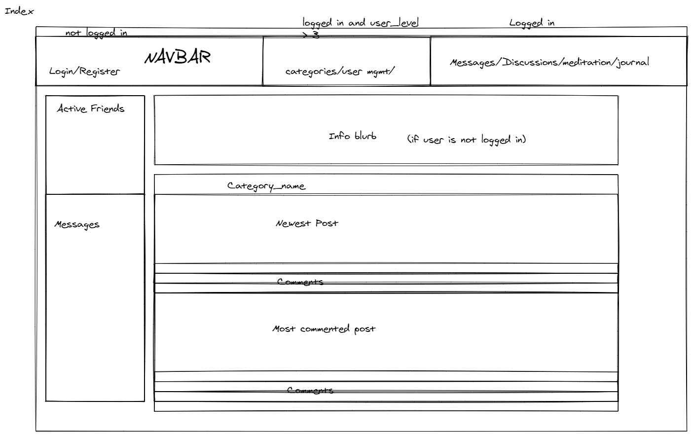
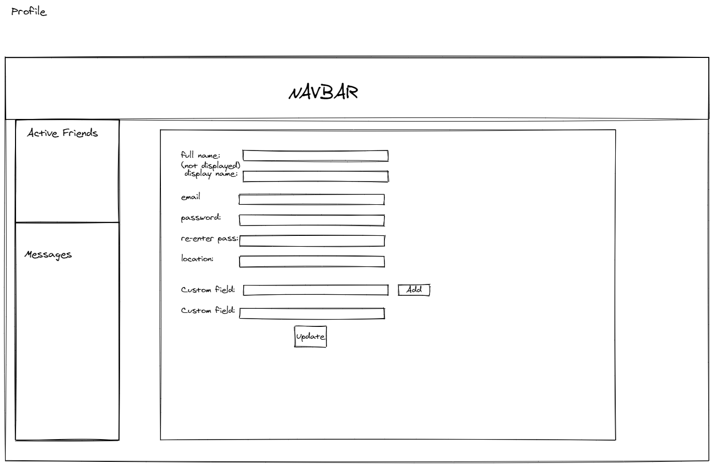
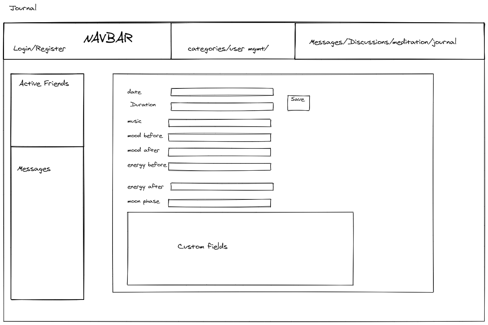
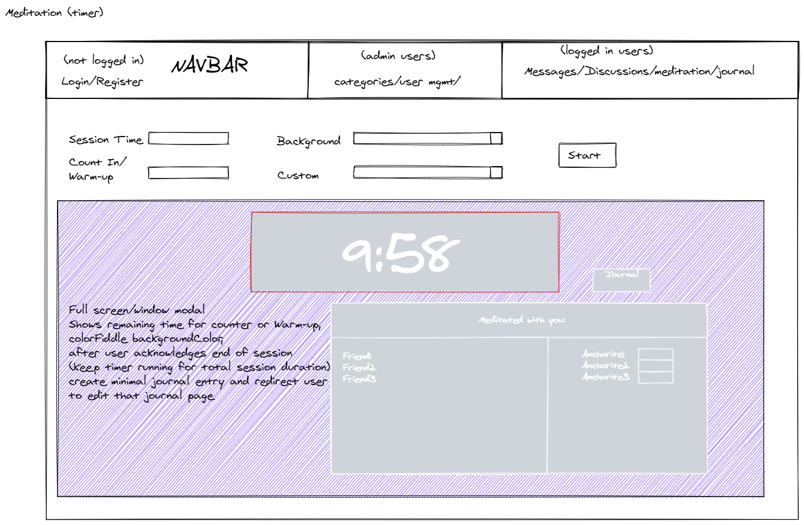
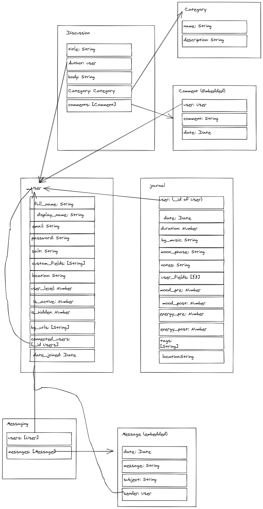

# Gladoire-FullStack
GA P3 project for JC North and Tom Erickson

## Concept
This is an extension of JC's P2 (Gladoire) which leverages React on the front end and 
an Express API/MongoDB on the back end.
It is a continuation of the original Gladoire, though starts from a completely new code base on both the front and back 
ends.
In addition to the journaling feature that was core to OG Gladoire, this new version adds:

- Customizable user fields for the journal.  Users can specify as many text fields as they like to make Gladoire truly 
  their own!
- Meditation Timer.  During P2 testing, my focus group drew a lot of comparisons with Insight Timer, and this was an 
  obvious feature to add
- Forum style discussions.  Users will able to post and comment on posts on a variety of topics 
  (topics determined by admins and adjustable via admin interface)
- Gladoire users can connect with other meditators via the "Also Meditating" feature, which allows users to connect based on their meditation schedules
  - Also, connected users can exchange private messages
  
## Design

- ### Home Page

- ### Profile Page

- ### Journal

- ### Timer

- ### ERD

